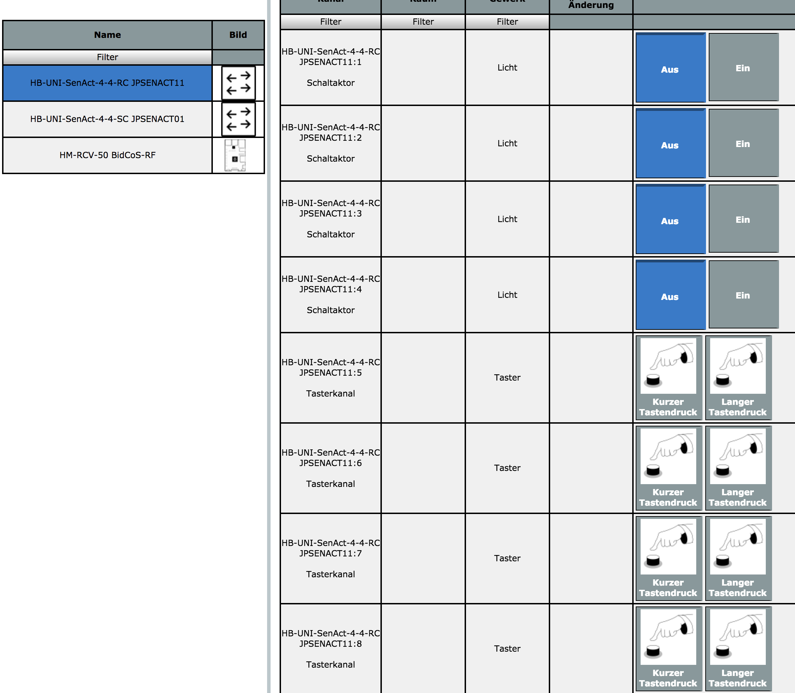
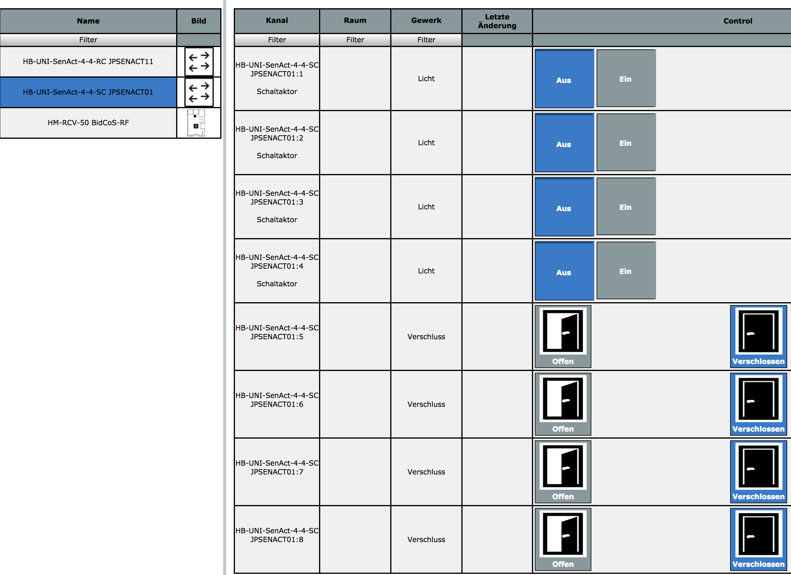
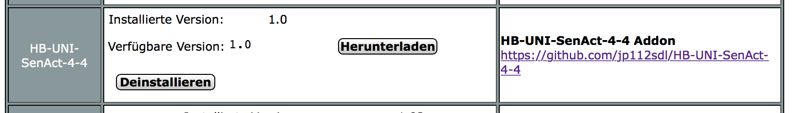
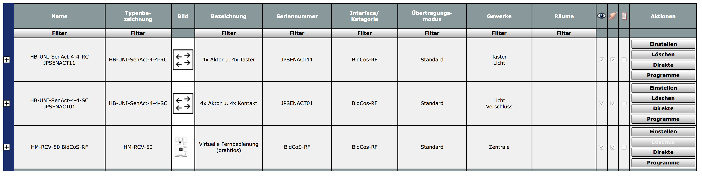

# HB-UNI-SenAct-4-4
## Universal 4fach-Aktor und 4fach-Sender (Taster/Schließer) für HomeMatic

## benötigte Hardware
* 1x Arduino Pro Mini **ATmega328P (3.3V / 8MHz)**
* 1x CC1101 Funkmodul **(868 MHz)**
* 1x FTDI Adapter (wird nur zum Flashen benötigt)
* 1x Taster (beliebig... irgendwas, das beim Draufdrücken schließt :smiley:)
* 1x LED 
* 1x Widerstand 330 Ohm (R1)
* Draht, um die Komponenten zu verbinden

## Verdrahtung
#### - folgt

## Code flashen
- [AskSinPP Library](https://github.com/pa-pa/AskSinPP) in der Arduino IDE installieren
  - Achtung: Die Lib benötigt selbst auch noch weitere Bibliotheken, siehe [README](https://github.com/pa-pa/AskSinPP#required-additional-arduino-libraries).
- je nach Anwendung
  - Projekt-Datei [HB-UNI-SenAct-4-4-RC](https://raw.githubusercontent.com/jp112sdl/HB-UNI-SenAct-4-4/master/HB-UNI-SenAct-4-4-RC/HB-UNI-SenAct-4-4-RC.ino) herunterladen.
  - Projekt-Datei [HB-UNI-SenAct-4-4-SC](https://raw.githubusercontent.com/jp112sdl/HB-UNI-SenAct-4-4/master/HB-UNI-SenAct-4-4-SC/HB-UNI-SenAct-4-4-SC.ino) herunterladen.
- Arduino IDE öffnen
  - Heruntergeladene Projekt-Datei öffnen
  - Werkzeuge
    - Board: Arduino Pro or Pro Mini
    - Prozessor: ATmega328P (3.3V 8MHz) 
    - Port: entsprechend FTDI Adapter
einstellen
- Menü "Sketch" -> "Hochladen" auswählen.

## Addon installieren
In der CCU2 (oder RaspberryMatic) muss vor dem Anlernen noch ein Addon installiert werden. 
Dieses kann [hier](https://github.com/jp112sdl/HB-UNI-SenAct-4-4/raw/master/Addon/HB-UNI-SenAct-4-4-addon.tgz) heruntergeladen werden. 
_Hinweis: Die Datei darf nicht entpackt werden!_ 
Über "Einstellungen"->"Systemsteuerung"->"Zusatzsoftware" wählt man die Datei aus und klickt auf "Installieren".
Die CCU2 startet automatisch neu. 
**Achtung: Nachdem das System wieder hochgefahren ist, muss noch einmal ein Neustart erfolgen!** 
**"Einstellungen"->"Systemsteuerung"->"Zentralenwartung", Button "Neustart"** 
Nun ist das Addon einsatzbereit. 

## Gerät anlernen
Wenn alles korrekt verkabelt und das Addons installiert ist, kann das Gerät angelernt werden. 
Über den Button "Gerät anlernen" in der WebUI öffnet sich der Anlerndialog. 
Button "HM Gerät anlernen" startet den Anlernmodus. 
Nun ist der Taster (an Pin D8) kurz zu drücken. 
Die LED (an Pin D4) leuchtet/blinkt für einen Moment. 
Anschließend ist das Gerät im Posteingang zu finden. 
Dort auf "Fertig" geklickt, wird es nun in der Geräteübersicht aufgeführt. 

  
